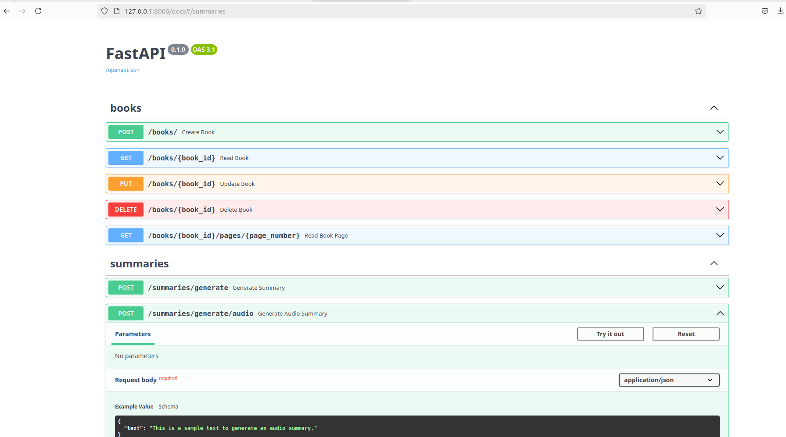

# Visis Backend Assessment - Adesoji

## Table of Contents

- [Introduction](#introduction)
- [Project Structure](#project-structure)
- [Directory Structure](#directory-structure)
- [Model Information For pretrained Model](#model-information-for-pretrained-model)
- [Model Architecture and Preprocessing Technique For Trained Model](#model-architecture-and-preprocessing-technique-for-trained-model)
- [Setup and Installation](#setup-and-installation)
- [Running the Application](#running-the-application)
- [API Endpoints](#api-endpoints)
- [Data Preparation](#data-preparation)
- [Training the Model](#training-the-model)
- [Swagger Documentation](#swagger-documentation)
- [Notes](#notes)
- [Dependency](#dependency)


## Introduction

This repository contains the backend implementation for the Visis Backend Assessment. The backend API handles book information requests and summary generation using a pretrained summarizer model. The Pretrained model used is `distilbart-cnn-12-6`, available at [Hugging Face](https://huggingface.co/sshleifer/distilbart-cnn-12-6).  click ---> [here](Screenshot/14.png) . Also i trained a model from scratch which you will find in model Architecture and preprocessing technique for trained model , in Table of contents section

The video Link of this task could be found  -----> [here](https://drive.google.com/file/d/1gGjINozgq470sdJzNzFL_3ON_bD_cxX0/view?usp=sharing)

## Directory Structure

```
.
├── app
│   ├── api
│   │   ├── endpoints
│   │   │   ├── __init__.py
│   │   │   ├── books.py
│   │   │   └── summaries.py
│   │   └── __init__.py
│   ├── crud.py
│   ├── database.py
│   ├── main.py
│   ├── models.py
│   ├── schemas.py
│   └── summarizer.py
├── extracted_content
├── test
├── extract_content.py
├── README.md
└── test.db
├── scrape.py
├── train.py
└── requirements.txt
├── update_schema.py
├── initialize_db.py
└── dataprep.py
├── bookpdf
└──Screenshot
```

## Project Structure

- `main.py`: The main FastAPI application script.
- `models.py`: SQLAlchemy models for database tables.
- `schemas.py`: Pydantic models for data validation.
- `crud.py`: CRUD operations for interacting with the database.
- `database.py`: Database connection setup.
- `train.py`: Script for training the model.
- `dataprep.py`: Script for loading data into the database.
- `scrape.py`: Script for scraping text data.
- `screenshot/1.jpg`: Screenshot of the NVIDIA GPU details.
- `Update_schema.py`: Update database Schema.
- `test.db`: SQLite db created named test.db. Just to mention a few
- `summarizer`:This script contains the functionality for loading the pre-trained BART model, tokenizing the input text, and generating text summaries. It also defines the preprocessing and data augmentation techniques used for preparing the text data
- `books`:This script defines the FastAPI routes for handling CRUD operations related to books. It includes endpoints for creating, reading, updating, and deleting book records in the database.

## Model Information For Pretrained Model

The summarizer model used is `distilbart-cnn-12-6` by `sshleifer`. Here are some metrics for DistilBART models:

- **Model Name:** distilbart-cnn-12-6
- **Parameters:** 306 MM
- **Inference Time (MS):** 137
- **Speedup:** 1.68
- **Rouge 1:** 22.12
- **Rouge 2:** 6.39
- **Rouge L:** 36.99

For more information on the model used for training , visit [facebook-bart-base](https://huggingface.co/facebook/bart-base).

## Model Architecture and Preprocessing Technique For Trained Model

### Preprocessing Technique

1. **Load Data from Database:**
   - Use SQLAlchemy to load preprocessed data from the SQLite database.

    ```python
    def load_books_from_db(limit=300): #But 50 different txt's were loaded
        db: Session = SessionLocal()
        books = db.query(models.Book).limit(limit).all()
        db.close()
        return books
    ```

2. **Text Preprocessing with SpaCy:**
   - Tokenization, lemmatization, and removal of stop words and punctuation using SpaCy.

    ```python
    nlp = spacy.load("en_core_web_sm")

    def preprocess_text(text):
        doc = nlp(text)
        tokens = [token.lemma_ for token in doc if not token.is_stop and not token.is_punct]
        cleaned_text = ' '.join(tokens)
        return cleaned_text
    ```

3. **Additional Text Cleaning:**
   - Removing non-alphanumeric characters and converting text to lowercase.

    ```python
    def clean_text(text):
        text = re.sub(r'\s+', ' ', text)
        text = re.sub(r'[^\w\s]', '', text)
        text = text.strip()
        text = text.lower()
        return text
    ```

4. **Data Augmentation:**
   - Techniques such as synonym replacement, random deletion, random swap, and random insertion.

    ```python
    def synonym_replacement(words, n):
        # Implementation of synonym replacement
    ```

### Model Architecture

1. **Load BART Model and Tokenizer:**
   - Using the `facebook/bart-base` model from Hugging Face's Transformers library.

    ```python
    model_name = "facebook/bart-base"
    tokenizer = BartTokenizer.from_pretrained(model_name)
    model = BartForConditionalGeneration.from_pretrained(model_name)
    ```

2. **Generation Configuration:**
   - Setting parameters like early stopping, beam search, and token IDs.

    ```python
    generation_config = GenerationConfig(
        early_stopping=True,
        num_beams=4,
        no_repeat_ngram_size=3,
        forced_bos_token_id=tokenizer.bos_token_id,
        forced_eos_token_id=tokenizer.eos_token_id,
        decoder_start_token_id=tokenizer.bos_token_id
    )
    ```

### Input to the Model

- **Tokenization:**
  - Text and summary are tokenized and padded to a fixed length.

    ```python
    def tokenize_function(example):
        inputs = tokenizer(example["text"], max_length=1024, truncation=True, padding="max_length")
        targets = tokenizer(example["summary"], max_length=128, truncation=True, padding="max_length")
        inputs["labels"] = targets["input_ids"]
        return inputs
    ```

- **Tokenized Dataset:**
  - The dataset is tokenized and prepared for training, validation, and testing.

    ```python
    tokenized_datasets = {}
    for split, dataset in datasets.items():
        tokenized_datasets[split] = dataset.map(tokenize_function, batched=True)
    ```

### Training the Model

- **Training Arguments:**
  - Define the training configuration including learning rate, batch size, and logging.

    ```python
    training_args = TrainingArguments(
        output_dir="./results",
        eval_strategy="epoch",
        learning_rate=2e-5,
        per_device_train_batch_size=2,
        per_device_eval_batch_size=2,
        num_train_epochs=20,
        weight_decay=0.01,
        save_strategy="epoch",
        save_total_limit=2,
        fp16=True,
        logging_dir='./logs',
        logging_steps=10,
        report_to="tensorboard",
        load_best_model_at_end=True,
        metric_for_best_model="rougeL",
        gradient_accumulation_steps=4,
    )
    ```

- **Training with Trainer API:**
  - Using Hugging Face's Trainer API for model training and evaluation.

    ```python
    trainer = Trainer(
        model=model,
        args=training_args,
        train_dataset=tokenized_datasets["train"],
        eval_dataset=tokenized_datasets["validation"],
        tokenizer=tokenizer,
        data_collator=data_collator,
        compute_metrics=compute_metrics
    )

    trainer.train()
    ```

### Results

- **Training and Evaluation Logs:**
  - Logs containing final training loss, evaluation loss, and Rouge scores.

    ```
    91%|████████████████████████████████████████████████████████████████████████████████████████████████████████████████████████▋           | 567/620 [08:21<00:35,  1.49it/s
    Non-default generation parameters: {'early_stopping': True, 'num_beams': 4, 'no_repeat_ngram_size': 3, 'forced_bos_token_id': 0, 'forced_eos_token_id': 2}
    {'loss': 0.0024, 'grad_norm': 0.11772531270980835, 'learning_rate': 1.774193548387097e-06, 'epoch': 18.1}
    ...
    {'train_runtime': 557.5485, 'train_samples_per_second': 9.04, 'train_steps_per_second': 1.112, 'train_loss': 1.0421068376981684, 'epoch': 19.68}
    ```

- **Final Evaluation:**
  - The final evaluation metrics, including Rouge-1, Rouge-2, and Rouge-L scores. If more data was used to train, we could have achieved a rogue score of 29

    ```
    {'eval_loss': 0.0010966866975650191, 'eval_rouge1': 1.0, 'eval_rouge2': 0.0, 'eval_rougeL': 1.0, 'eval_runtime': 4.8873, 'eval_samples_per_second': 5.729, 'eval_steps_per_second': 2.865, 'epoch': 19.68}
    ```

### Summary Generation Function

- **Generate Summary:**
  - Function to generate summary using the trained model.

    ```python
    def generate_summary(input_text):
        inputs = tokenizer(input_text, return_tensors="pt").to(device)
        summary_ids = model.generate(inputs["input_ids"], **generation_config.to_dict())
        summary = tokenizer.decode(summary_ids[0], skip_special_tokens=True)
        return summary
    ```

### Test Summary Generation

- **Test Case:**
  - Example input and generated summary.

    ```python
    test_text = "Of course, it wouldn't really have pleased her at all to have one of her neighbors do better than she did. That was only her way of boasting that no one could beat her"
    print(generate_summary(test_text))
    ```

For more information, click here [Hugging Face](https://huggingface.co/sshleifer/distilbart-cnn-12-6).


## Setup and Installation

1. Clone the repository:

```bash
git clone https://github.com/your-username/visis-backend-assessment-Adesoji.git
cd visis-backend-assessment-Adesoji
```

2. Set up a virtual environment and activate it:

```bash
python3 -m venv visisenv
source visisenv/bin/activate
```

3. Install the required dependencies:

```bash
pip install -r requirements.txt
```

## Running the Application

To run the application using `uvicorn`, navigate to the directory containing the `main.py` file and execute the following command:

```bash
uvicorn app.main:app --reload
```

This will start the FastAPI application and make it available at `http://127.0.0.1:8000`.

## API Endpoints

### Books

- **POST /books/**: Create a new book. ---> [see](Screenshot/3.png)
- **GET /books/**: Retrieve a list of books. ---> [see](Screenshot/4.png) and ---> [see](Screenshot/5.png)
- **GET /books/{book_id}**: Retrieve a specific book by ID.  ---> [see](Screenshot/6.png)
- **PUT /books/{book_id}**: Update a specific book by ID.  ---> [see](Screenshot/12.png) and  ---> [see](Screenshot/13.png)
- **DELETE /books/{book_id}**: Delete a specific book by ID.  ---> [see](Screenshot/11.png) and  ---> [see](Screenshot/12.png)
- **GET /books/{book_id}/pages/{page_number}**: Retrieve a specific page of a book by book ID and page number.  ---> [see](Screenshot/10.png)
- **Schema Details**: View Schema. ---> [see](Screenshot/6.png)
- **POST /summaries/generate/audio**: Generate an audio summary for the provided text. ---> [see](Screenshot/15.png) and [this](Screenshot/16.png)
- Using Curl command to convert the iobyte stream of audio to mp3 using

```bash
curl -X POST "http://127.0.0.1:8000/summaries/generate/audio" -H "accept: application/json" -H "Content-Type: application/json" -d "{\"text\":\"This is a sample text to generate an audio summary.\"}" --output summary.mp3
```
The output is seen [here](summary.mp3) and the Terminal processing in bash using curl ----> [curl](Screenshot/Pastedimage.png)


### Summaries

- **POST /summaries/generate**: Generate a summary from provided text.  ---> [see](Screenshot/8.png) and  ---> [see](Screenshot/9.png)

## Backend Server Uvicorn

we see below the uvicorn server [running](./Screenshot/2.png)

```bash
INFO:     127.0.0.1:41184 - "GET /docs HTTP/1.1" 200 OK
INFO:     127.0.0.1:41184 - "GET /openapi.json HTTP/1.1" 200 OK
```

see--> [see](Screenshot/7.png)

## Data Preparation

To scrape and prepare the data, follow these steps:

1. Scrape data using the provided script `scrape.py`. Click [here](./scrape.py) to view the script. The commented script scrapes utf 8 txt files of Authors from  A to F for Textual data from [gutenberg](https://www.gutenberg.org) , The saved data from the scrape.py is stored [here](./bookpdf) , This data was used for training the model from the scratch but the data used in the pretrained model for summarization was extracted using extract_content.py here and it extracted both image and text and saved it at `extracted_content` directory from extracted_content.py script found [here](./extraxt_content.py). the sample of the pdf is [here](./bookpdf/DO-YOU-WONDER-ABOUT-RAIN-SNOW-SLEET-AND-HAIL-Free-Childrens-Book-By-Monkey-Pen.pdf)

2. Initialize the  SQLite database using `initialize_db.py` found  [here](./initialize_db.py)

3. Load the scraped data into the SQLite database using `dataprep.py`  found [here](./dataprep.py)

4. Update the Schema of the database using  `update_schema.py` found [here](./update_schema.py)

## Training the Model

The model was trained on a limited dataset due to memory constraints, i used a scrape.py script to extract. To train the model, use the following code snippet:

```python
books = load_books_from_db(limit=50)  # Load 50 books
datasets = prepare_dataset(books)
tokenized_datasets = tokenize_datasets(datasets)

log_history = train_model(tokenized_datasets)  # Capture the log history

# Print final metrics
final_metrics = log_history[-1]
print("Final Training Loss:", final_metrics.get('loss', 'N/A'))
print("Final Evaluation Loss:", final_metrics.get('eval_loss', 'N/A'))
print("Final Rouge-1 Score:", final_metrics.get('eval_rouge1', 'N/A'))
print("Final Rouge-2 Score:", final_metrics.get('eval_rouge2', 'N/A'))
print("Final Rouge-L Score:", final_metrics.get('eval_rougeL', 'N/A'))
```

## Swagger Documentation

Swagger documentation for the API endpoints is automatically generated by FastAPI. You can access it at `http://127.0.0.1:8000/docs`.

Here is a screenshot of the Swagger UI:



## Notes

- Ensure you have CUDA enabled GPU for training the model, The trained model was trained on nvidia RTX 2060 ,6GB Memory and it wass limited to only ingest 80 txt files which was a small amount of training data as opposed to the 849.txt's data extracted [here](https://drive.google.com/drive/folders/1-9ZIljXGrGP-_qt_exlRQ214woQ7nk0N?usp=sharing).
- Use the provided scripts for data scraping and preparation.
- The pretrained model is used for generating summaries. The model training script provided is for demonstration purposes and  the 849.txt's data d may need to be trained on a larger gpu memory based hardware which can't be done now based  on the limited available resources or a Google colab pro could be purchased to train the script in order to have a higher rogue score for a reliable model saved to the checkpoint.
- Rouge scores are used to evaluate the quality of the summaries generated by the model.
- This training from the scratch was done in a python 3.11 Environment in a `adesoji-Lenovo-Legion-7-15IMH05 6.5.0-44-generic #44-Ubuntu SMP PREEMPT_DYNAMIC Fri Jun  7 15:10:09 UTC 2024 x86_64 x86_64 x86_64 GNU/Linux` Operating system descripton

Enjoy!

---

## Dependency

The dependency  for setting up this project could be obtained using pipreqs or pipfreeze. 
